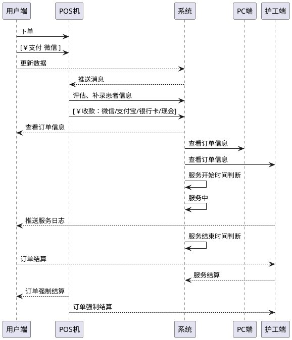
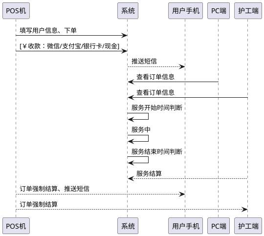

# 01. 订单与结算逻辑.订单

> 
- **时间**：2018年8月9日
@[订单, 支付方式, 结算逻辑]

-------------------

[TOC]

## 数据字典

### 系统角色
| 端  |    用户群体 |    终端类型 | 终端名称  |
| :-------- |:--------| :--: |:--------|
| 用户端  |患者、消费者 | 微信公众号 | E护通  |
| 护工端  |院内护工、居家护工 |  微信公众号  | E护通\|护工  |
| 护士端  |提供上门服务的在册护士 | 微信公众号/APP  | 护通\|专护 |
| POS机端 |擎浩医院管理老师| POS机  |  |
| PC端 |财务、运营、系统管理员等| PC电脑端 |   |
| 统计端|院方高层、护理界高层| 微信公众号  | 擎浩护理  |


### 院内订单类型
| 订单类型  | 前提条件 |  工资计算说明| 
| :-------- |:--------| :--: |
| 1对1订单 | 院内有机动护工 | 系统计算、每日按照比例分配 |
| 1对多订单 | 当前病区绑定了护工 |  系统计算、每日按照比例分配   | 
| 团队制订单| 当前病区支持团队制 | 不统计报表  | 
| 单项订单 |擎浩医院管理老师| 待定 | 


## 下单相关流程
### 用户下单(时序图):




###用户下单(流程图):
``` flow
st=>start: 开始
e=>end: 结束
e2=>end: 结束
op1=>operation: 填写患者信息
sub1=>subroutine: 选择1对1护工
sub2=>subroutine: 选择1对多护工
cond1=>condition: 选择下单方式（1对1）
cond2=>condition: 选择下单方式（1对多）
sub3=>subroutine: 微信、支付宝、银行卡、现金
cond3=>condition: 在线微信支付
op4=>operation: POS机收款
op5=>operation: POS机收款成功
op6=>operation: 支付成功


st->op1->cond1
cond1(no)->cond2
cond1(yes)->sub1->cond3
cond2(yes)->sub2->cond3
cond2(no)->e2
cond3(no,left)->op4->sub3->op5->e
cond3(yes)->op6->e2

```


### POS机代下单(时序图):



### POS机代下单(流程图):
``` flow
st=>start: 开始
e=>end: 结束
e2=>end: 结束
op1=>operation: 填写患者信息
sub1=>subroutine: 选择1对1护工
sub2=>subroutine: 选择1对多护工
cond1=>condition: 选择下单方式（1对1）
cond2=>condition: 选择下单方式（1对多）
sub3=>subroutine: 微信、支付宝、银行卡、现金
cond3=>condition: 在线微信支付
op4=>operation: POS机收款
op5=>operation: POS机收款成功
op6=>operation: 支付成功


st->op1->cond1
cond1(no)->cond2
cond1(yes)->sub1->cond3
cond2(yes)->sub2->cond3
cond2(no)->e2
cond3(no,left)->op4->sub3->op5->e
cond3(yes)->op6->e2

```


## 下单接口文档

### 1. 用户端下单接口说明

- **请求URL**
> [http://localhost:8881/api/order/create](#)

- **请求方式** 
>**POST**

- **请求参数**
  
| 请求参数      |     参数类型 | 必须 | 参数说明   | 参考值|
| :-------- | :--------|:--------| :------ |:------ |
| uopid|String|必须| 用户Uopid|odkVKsyBVCiPkzsiJtmCaaAPs6Xc|
| ordtp|Integer|必须| 订单类型|1|
| svctp|Integer|必须| 服务类型：1 一对一 / 2 一对多 / 3 团队制| 2|
| svcday|Integer|必须| 服务天数| 4| 
| uphone|String|必须| 患者手机号码| 18616579337|
| startday|Date|必须| 服务开始时间| 2018-08-13|
| pstnid|String|必须| 病区ID|581|
| bed|String|必须| 床位号| 33|
| sitmid|Integer|| 价格ID| 297|
| svctp2|String|| 服务类型2||
| nightcare|Boolean|| 夜陪标志|true|
| age|Integer|必须| 年龄| 76|
| disease|Integer||疾病标签||
| rlnm|String||患者真实姓名|患者姓名|
| sex|String|| 性别：0 女 1男| 1|
| wuid|String|| 护工UID| WK_cSjgwj5nIhdzJ_kfd83oNnH6I8yBZ|

- **返回参数**
  
| 返回参数      |     参数类型 |   参数说明   | 参考值|
| :-------- | :--------| :------ |:------ |
| success|   boolean|  请求成功与否||
| code|   Integer|  执行结果code|0|
| message|   String| 执行结果|  执行成功 |
| orduid|   String| 订单号码|  ORD_48dj2B3vU1NkPOQjYpveN6YPOo05 |

- **返回示例**
>    
```java 
{
  "success": true,
  "code": 0,
  "message": "操作正确"
  "orduid":"ORD_48dj2B3vU1NkPOQjYpveN6YPOo05"
}
```
### 2. POS机代下单接口文档
- **请求URL**
> [http://localhost:8883/api/posorder/replace](#)

- **请求方式** 
>**POST**

- **请求参数**

| 请求参数      |     参数类型 | 必须 | 参数说明   | 参考值|
| :-------- | :--------|:--------| :------ |:------ |
| wstatncd|String|必须| 所在护工站CD|31010900053|
| svctp|String|必须| 服务类型：1 一对一 / 2 一对多 / 3 团队制|2|
| svcday|Integer|必须| 服务天数| 8|
| uphone|String|必须| 患者手机| 18616579337| 
| startday|Date|必须| 服务开始时间| 2018-08-13|
| pstnid|String|必须| 病区ID|581|
| bed|String|必须| 床位号| 1|
| age|Integer|必须| 年龄| 76|
| disease|Integer||疾病标签||
| rlnm|String||患者真实姓名|患者姓名|
| sex|String|| 性别：0 女 1男| 1|
| wuid|String|| 护工UID| WK_cSjgwj5nIhdzJ_kfd83oNnH6I8yBZ|
| uoipd|String|| 用户uopid|null|
| sitmid|Integer|| 价格ID| 297|
| grpamount|Integer|| 团队制订单价格| null|

- **返回参数**

| 返回参数      |     参数类型 |   参数说明   | 参考值|
| :-------- | :--------| :------ | :------ | 
| success|   boolean|  请求成功与否| |
| code|   Integer|  执行结果code| |
| message|   String|  执行结果消息| |
| orduid|   String|  执行结果消息|ORD_X7IS7TYobMXybv9hfEqPFoavsrQw |

- **返回示例**
>    
```java 
{
  "success": true,
  "code": 200,
  "message": "操作正确",
  "orduid":"ORD_X7IS7TYobMXybv9hfEqPFoavsrQw"
}
```


